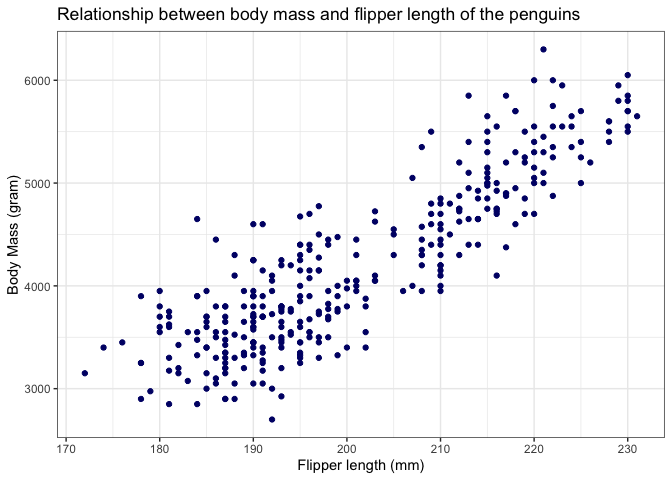
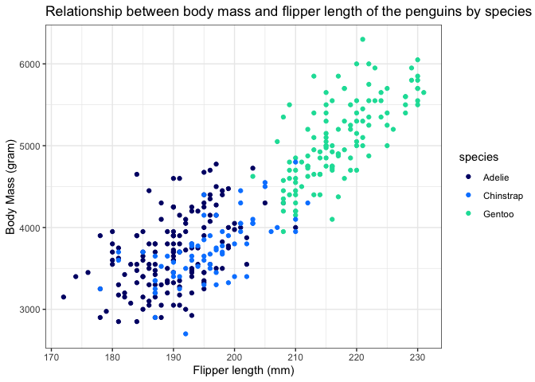

<!-- README.md is generated from README.Rmd. Please edit that file -->

# YlGrBlPal

<!-- badges: start -->

<!-- badges: end -->

The goal of YlGrBlPal is to …

## Installation

You can install the released version of YlGrBlPal from
[CRAN](https://CRAN.R-project.org) with:

``` r
install.packages("YlGrBlPal")
```

And the development version from [GitHub](https://github.com/) with:

``` r
# install.packages("devtools")
devtools::install_github("etc5523-2021/r-package-takehome-ShaineHo")
```

## Description

YlGrBlPal provides a set of colors including Yellow, Green, Turquoise,
Indigo and Blue that can be applied to ggplot2 plot. It can be used in
discrete-scale color and fill or continuous-scale color.

## Examples

These are some basic examples which show you how to solve common
problems:

``` r
library(YlGrBlPal)
library(palmerpenguins)
library(ggplot2)
library(colorspace)
```

### Example for YlGrBl\_pal()

``` r
library('ggplot2')
 ggplot(data = penguins, aes(x = flipper_length_mm, y = body_mass_g)) +
 geom_point(color = YlGrBl_pal()(1))+
   theme_bw()+
   labs(x = "Flipper length (mm)",
        y = "Body Mass (gram)",
        title = "Relationship between body mass and flipper length of the penguins")
#> Warning: Removed 2 rows containing missing values (geom_point).
```

 \#\#\#
Example for discrete-scale

``` r
ggplot(data = penguins, aes(x = flipper_length_mm, y = body_mass_g)) +
geom_point(aes(color = species))+
scale_colour_YlGrBl_d()+
  theme_bw()+
  labs(x = "Flipper length (mm)",
        y = "Body Mass (gram)",
        title = "Relationship between body mass and flipper length of the penguins by species")
#> Warning: Removed 2 rows containing missing values (geom_point).
```


